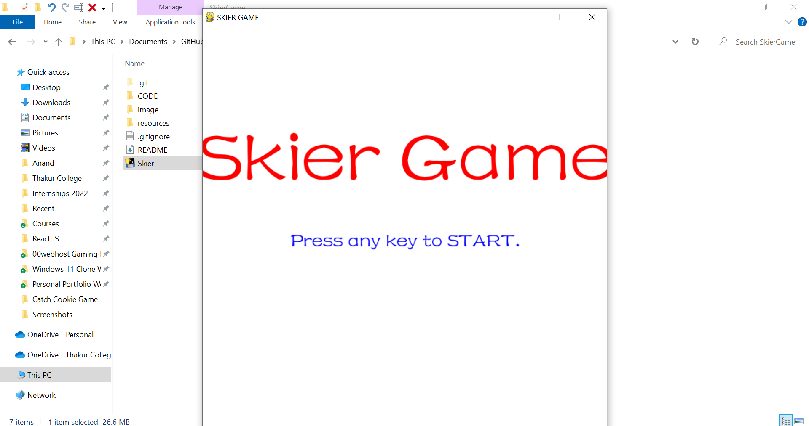
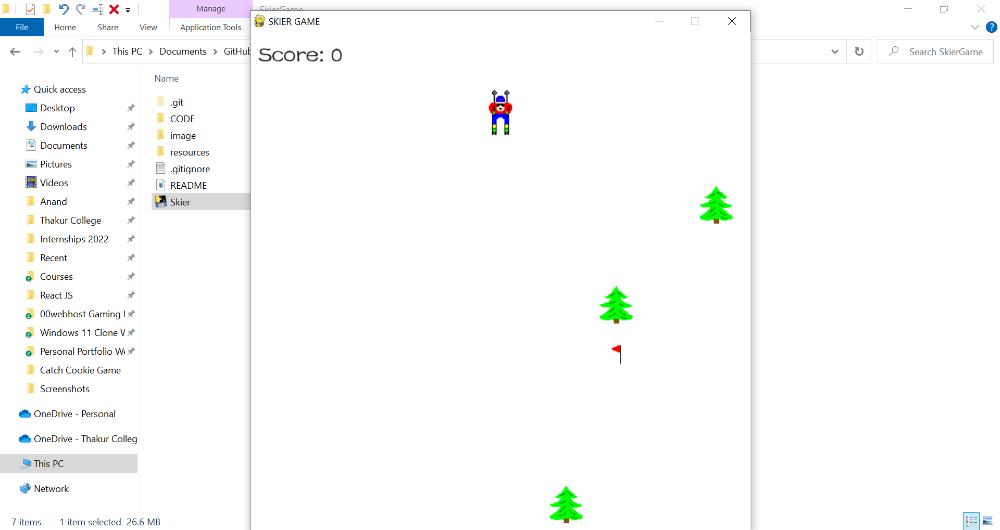
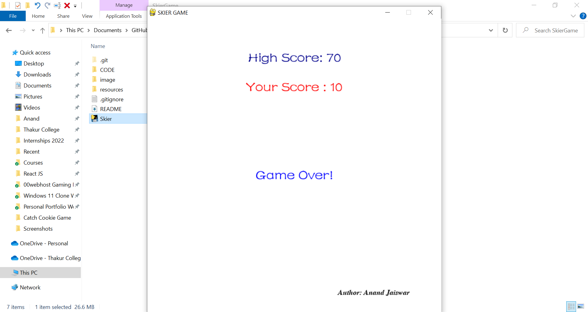

# SkierGame

In this, I have created a interactive game using Python and its most famous module name as Pygame.

* For running this project, you neither need Python nor Pygame module installed in your local computer.
* Just Click on Skier.exe and there you go. (No Virus Guaranteed).
* If you want the code of the project, Just go to the CODE folder and enjoy... But you need to install pygame and python in your local computer.
* pip install pygame
  * Just type the above command in your Command Promt.

